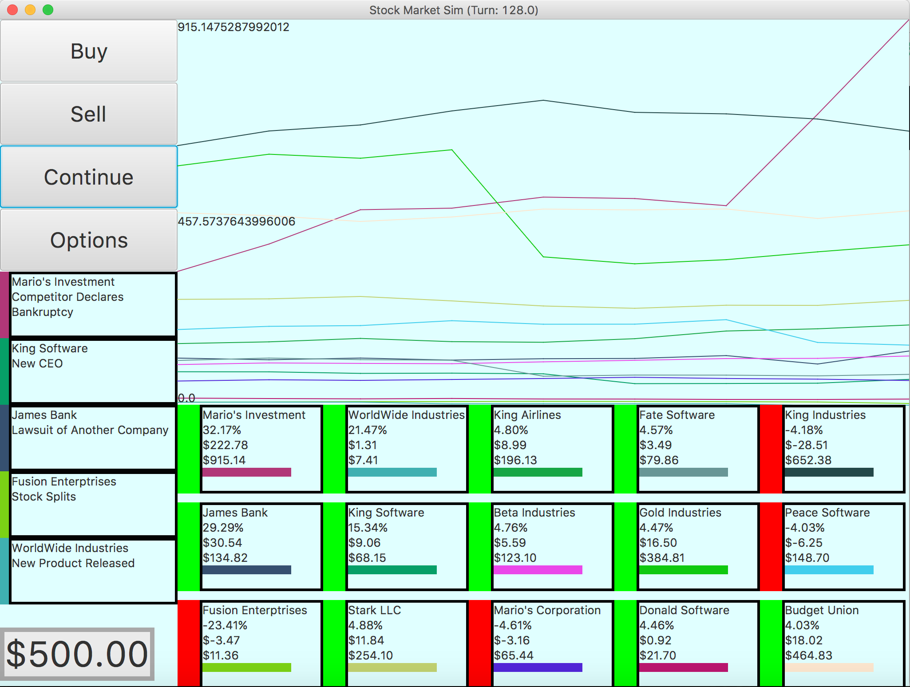
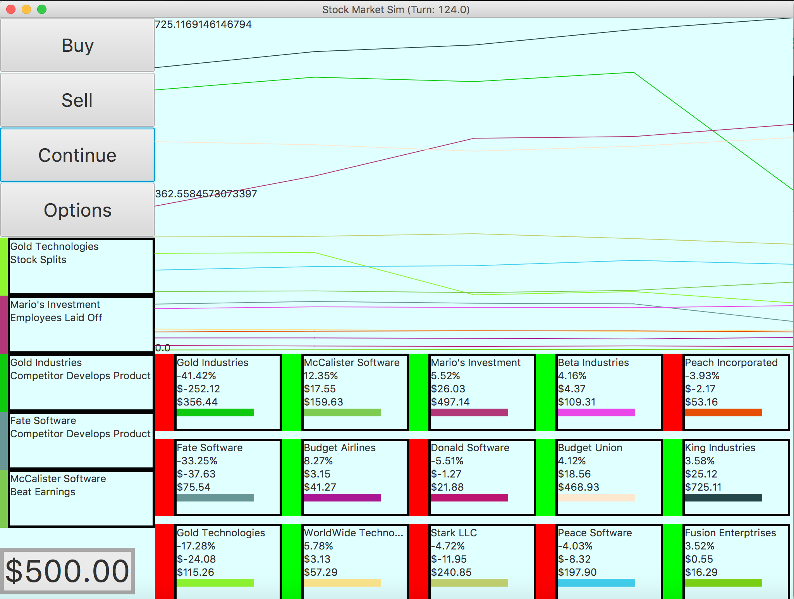
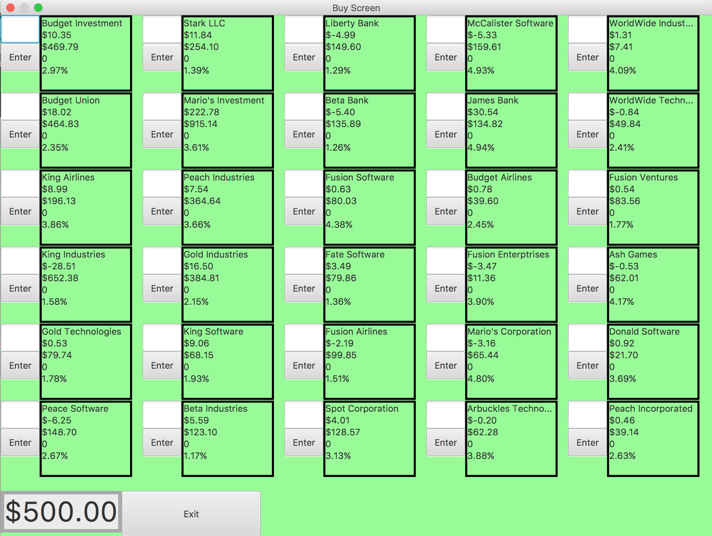
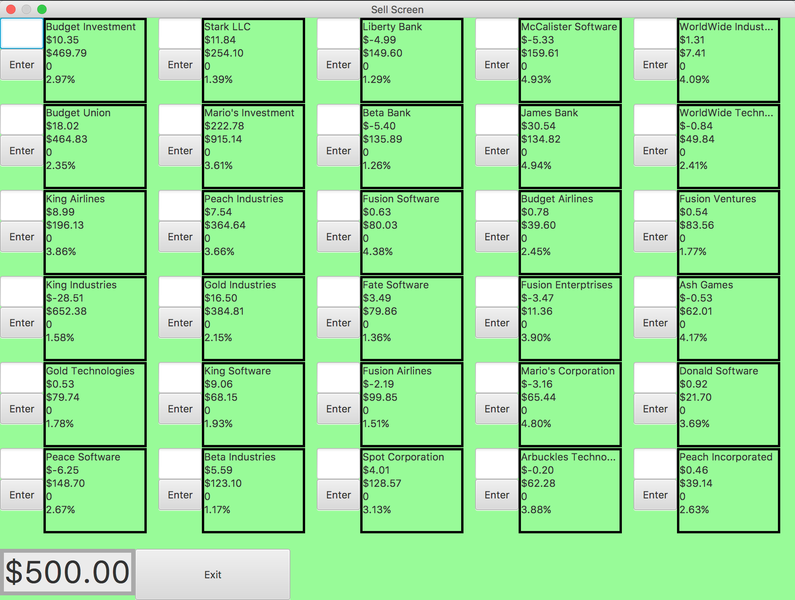
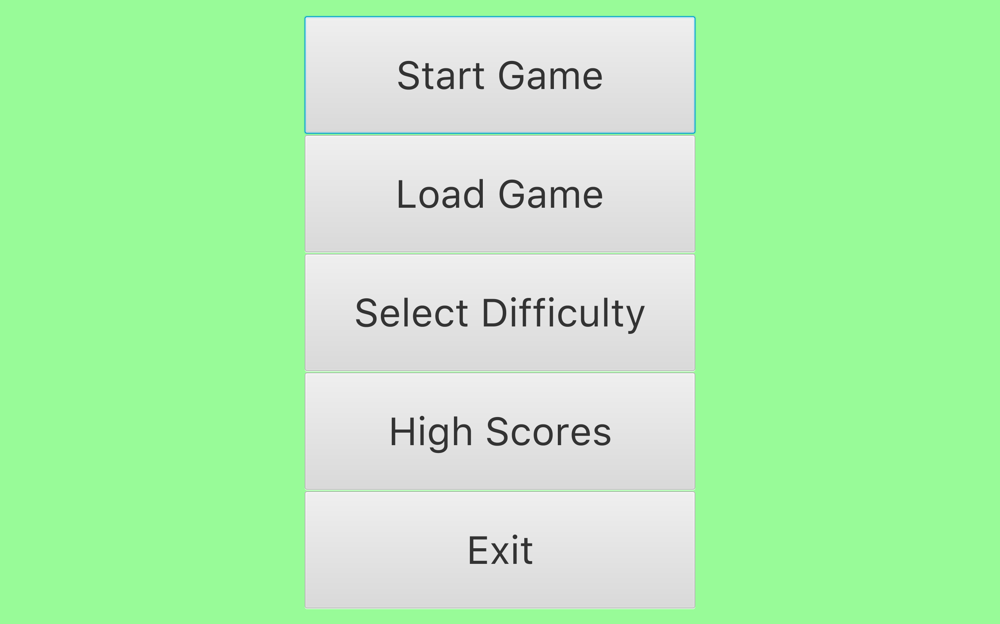

# StockMarketSimulator (Java)
## Description
Users can select from one of two game modes (freeplay or time trial) and three difficulties when first starting the game. They are then given a selected amount of money to begin with from which then can use to buy different stocks from one of the listed companies. Each round, several companies will effected by a variety of possible events which cause an increase or decrease in the stock price, simulating a fictional stock market. Users can continue to buy stock or sell those which they already own in an effort to accumulate more capital.
#### Time Trial
This game mode gives users a set time window in which they can buy and sell stock to build their monetary balance.
#### Freeplay
This game mode has no time limit and gives the user more freedom with how they want to play.

## Screenshots
### Home Screen

### Buy Screen

### Sell Screen

### Start Screen

